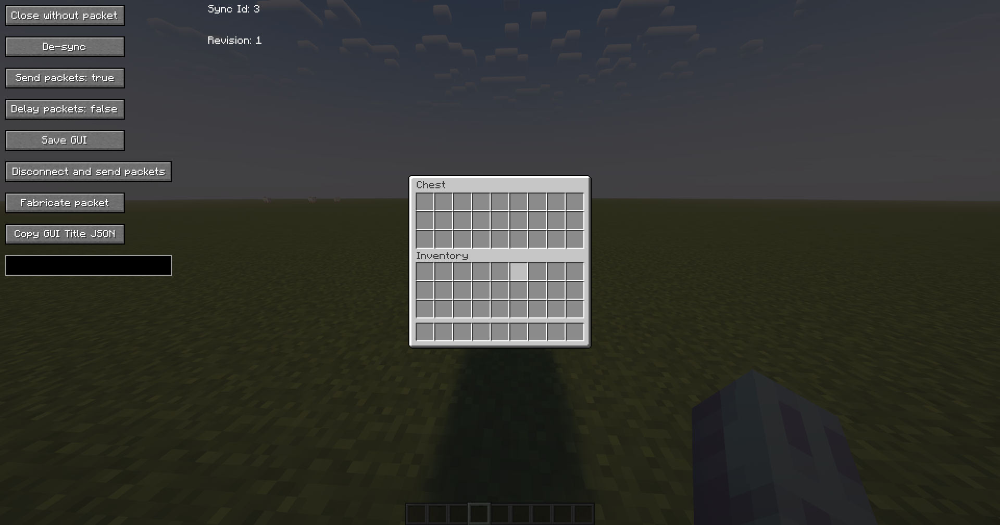
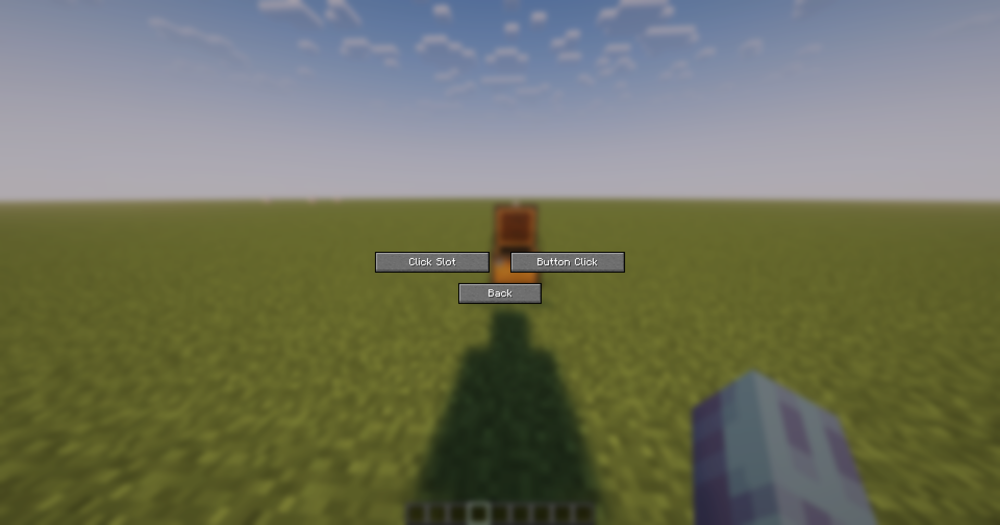
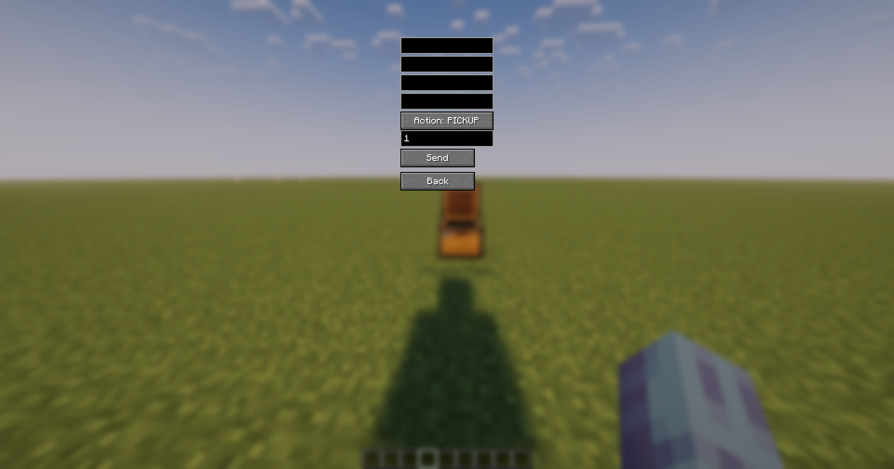
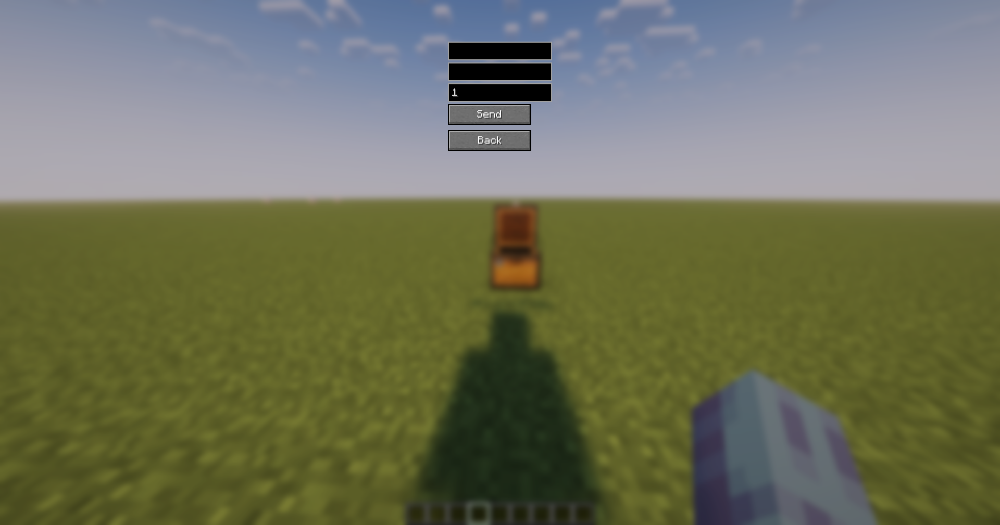

# Pacify
GUI packet control mod for Minecraft. Requires Fabric API. Made and delivered by [Hexa Studios](https://hexastudios.net)!

⚠️ Please be aware that official releases only are being uploaded on this official GitHub page ([github.com/lyamray/pacify]()) & on Hexa Studios official website:
- [hexastudios.net](https://hexastudios.net/projects/3)

If you have any questions, please join our discord server or contact us via this email address:
- [info@hexastudios.net]
- [Hexa Studios Discord](https://discord.gg/hexastudios)

## Latest changes:

---

- Added dialog screen support.
- Planned releases for Minecraft 1.21.8, 1.21.9, 1.21.10, 1.21.11 and the upcoming 26.1 update.
- Added a command to toggle the in-game GUI rendering on and off.
- Rewrote the entire codebase from scratch, improving code quality and maintainability (from the original UI-Utils codebase).
---

# How to use:

---

- Open any inventory / container with the mod, and you should see some buttons and a text field.



- "Close without packet" closes your current GUI (ScreenHandler) without sending a `CloseHandledScreenC2SPacket` to the server. It also automatically saves the GUI so you can restore it with V.

- "De-sync" closes your current GUI server-side and keeps it open client-side.

- "Send packets: true/false" tells the client whether it should send any `ClickSlotC2SPacket`(s) and `ButtonClickC2SPacket`(s).

- "Delay packets: true/false" when turned on it will store all `ClickSlotC2SPacket`(s) and `ButtonClickC2SPacket`(s) into a list and will not send them immediately until turned off, which sends them all at once.

- "Save GUI" saves your current GUI to a variable and can be restored by pressing V (configurable in keybinding options).

- "Disconnect and send packets" will, if "Delay packets" is turned on, send the list of stored packets immediately and then disconnect right afterward (can create potential race conditions on non-vanilla servers).

- "Sync Id: ??" is a number used internally to sync various GUI related packets.

- "Revision: ??" is a number used internally to sync various GUI related packets sent from the server to the client.

- "Fabricate packet" allows you to create a custom `ClickSlotC2SPacket` and `ButtonClickC2SPacket` within a screen it opens.

- "Copy GUI Title JSON" copies the name of your current GUI in JSON format.

- The text box is a chat field for chatting or running commands while in a GUI.

---

### Fabricate packet tutorial (Click Slot):

---

- `ClickSlotC2SPacket`(s) are what the client sends to the server when clicking any slot in a GUI (e.g. shift clicking an item).

- When clicking the "Fabricate packet" button you should see a screen appear with two options: "Click Slot" and "Button Click".



- Clicking "Click Slot" will open the Click Slot packet screen.



- Enter the "Sync Id" and "Revision" value you see in the in-game GUI (shown top right of any open inventory).

- The "Slot" value should be set to what slot you would like to click (starting from 0). You can generally find the location of GUI slots on Google for generic GUIs, e.g. double chest.

- The "Button" field should be set to either 0 (left-click) or 1 (right-click). When using the SWAP action, 0-8 swaps with a hotbar slot and 40 swaps with your offhand.

- The "Action" field should be set to one of these options:
    - "PICKUP" puts the item on the slot field on your cursor or vice versa.
    - "QUICK_MOVE" is a shift click.
    - "SWAP" acts as a hotbar or offhand swap. If "Button" is set to 0-8 it swaps the item in the "Slot" field to one of those hotbar slots (starting from 0), or vice versa. "Button" set to 40 swaps the item to your offhand or vice versa.
    - "CLONE" acts as a middle click to clone items (only works in creative mode).
    - "THROW" drops the item in the "Slot" field.
    - "QUICK_CRAFT" is complex — experiment yourself or look into the Minecraft source for it.
    - "PICKUP_ALL" picks up all items matching the item on your cursor, as long as "Slot" is within bounds of that GUI.

- The "Times to send" field tells the client how many times to send that packet when pressing "Send".

- The "Send" button sends the packet with all the info you inputted.

---

### Fabricate packet tutorial (Button Click):

---

- `ButtonClickC2SPacket`(s) are what the client sends to the server when clicking a button in a server-side GUI (e.g. clicking an enchantment in an enchantment table).

- Clicking "Button Click" will open the Button Click packet screen.



- Enter the "Sync Id" field as the sync id value shown top right in the in-game GUI.

- Enter the "Button Id" field as what button you would like to click in a GUI (starting from 0). For example, an enchanting table uses button ids 0, 1, and 2 for its three enchantment options. Lecterns use button ids for page navigation.

- Enter into "Times to send" the amount of packets you would like to send (default is 1).

---

## "^togglepacify" command:

---

- Enables/Disables Pacify's in-game GUI rendering. Can be typed in the chat field shown inside any open inventory.

---

## About:

---

Pacify is inspired by the original [UI-Utils](https://github.com/Coderx-Gamer/ui-utils) mod. The goal of Pacify is to keep the concept alive on higher Minecraft versions and expand on it with new features. The codebase is a complete rewrite from scratch.

---

## Building:

---

Clone the repository from [github.com/lyamray/pacify](https://github.com/lyamray/pacify) and run:
```bash
./gradlew build
```

The output jar will be in `build/libs/`.