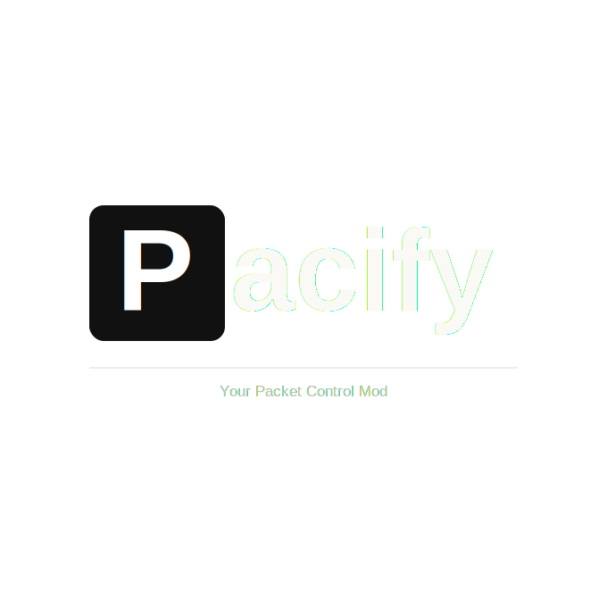

# Pacify

[](https://www.minecraft.net/)
[](https://fabricmc.net/)

A GUI packet control mod for Minecraft that provides advanced control over GUI interactions and packet sending. Requires Fabric API. Developed and delivered by [Hexa Studios](https://hexastudios.net)!

> **⚠️ Official Releases Notice**  
> Official releases are only available on the [GitHub repository](https://github.com/lyamray/pacify) and the [Hexa Studios website](https://hexastudios.net/projects/3). Please ensure you download from these trusted sources.

## Table of Contents

- [Features](#features)
- [Installation](#installation)
- [Usage](#usage)
- [Fabricate Packet Tutorials](#fabricate-packet-tutorials)
- [Commands](#commands)
- [Future Plans](#future-plans)
- [Latest Changes](#latest-changes)
- [About](#about)
- [Contact](#contact)
- [License](#license)

## Features

Pacify empowers players with enhanced control over GUI interactions and network packets, enabling experimentation and advanced gameplay mechanics. Key features include:

- **Packet Control**: Toggle sending of `ClickSlotC2SPacket` and `ButtonClickC2SPacket` packets.
- **Delayed Packets**: Queue packets and send them all at once for synchronized actions.
- **GUI Manipulation**: Close GUIs without packets, de-sync client/server states, and save/load GUI states.
- **Packet Fabrication**: Create and send custom click slot and button click packets.
- **Server Integration**: Display server details and handle various GUI types including dialogs.
- **User-Friendly Interface**: Intuitive buttons and text fields for easy access to features.

Our goals:
- Provide granular control over GUI interactions and server communications.
- Enable safe experimentation with custom packets for testing or creative purposes.
- Maintain compatibility with the latest Minecraft versions and popular mods.
- Offer a simple, accessible interface for users of all technical levels.
- Foster community creativity through unique GUI interaction tools.
- Ensure stability and performance, even with advanced features like packet fabrication and delayed sending.

## Installation

### Prerequisites
- Minecraft 1.21.8 or later
- [Fabric Loader](https://fabricmc.net/use/installer/)
- [Fabric API](https://modrinth.com/mod/fabric-api)

### Building from Source
1. Clone the repository:
   ```bash
   git clone https://github.com/lyamray/pacify.git
   cd pacify
   ```

2. Build the mod:
   ```bash
   ./gradlew build
   ```

3. The compiled JAR will be located in `build/libs/`.

### Installation Steps
1. Download the latest release from the [official GitHub repository](https://github.com/lyamray/pacify) or [Hexa Studios website](https://hexastudios.net/projects/3).
2. Place the JAR file in your Minecraft `mods` folder.
3. Launch Minecraft with Fabric.

## Usage

Open any inventory or container while Pacify is installed to access the mod's interface.


### Interface Elements

- **Close without packet**: Closes the current GUI without sending a `CloseHandledScreenC2SPacket`. Automatically saves the GUI state for later restoration with the 'V' key.
- **De-sync**: Closes the GUI server-side while keeping it open client-side.
- **Send packets**: Toggle whether to send `ClickSlotC2SPacket` and `ButtonClickC2SPacket` packets (true/false).
- **Delay packets**: Queue packets instead of sending immediately. When disabled, sends all queued packets at once (true/false).
- **Save GUI**: Saves the current GUI state for later restoration via the 'V' key (configurable in keybindings).
- **Disconnect and send packets**: Sends queued packets (if delay is enabled) and disconnects immediately. May cause race conditions on non-vanilla servers.
- **Sync Id**: Internal synchronization number for GUI-related packets.
- **Revision**: Internal revision number for server-to-client packet synchronization.
- **Fabricate packet**: Opens a menu to create custom packets.
- **Copy GUI Title JSON**: Copies the current GUI's title in JSON format.
- **Chat field**: Send messages or commands while in a GUI.

## Fabricate Packet Tutorials

### Click Slot Packets

`ClickSlotC2SPacket` packets are sent when interacting with inventory slots (e.g., clicking or shift-clicking items).

1. Click "Fabricate packet" and select "Click Slot".

   

2. Fill in the packet details:

   

   - **Sync Id & Revision**: Use the values displayed in the top-right of the in-game GUI.
   - **Slot**: The slot number to interact with (starting from 0). Reference online resources for specific GUI layouts.
   - **Button**: 0 for left-click, 1 for right-click. For SWAP actions: 0-8 for hotbar slots, 40 for offhand.
   - **Action**: Choose from:
     - `PICKUP`: Pick up or place items on cursor.
     - `QUICK_MOVE`: Shift-click behavior.
     - `SWAP`: Swap with hotbar (0-8) or offhand (40).
     - `CLONE`: Middle-click clone (creative mode only).
     - `THROW`: Drop the item in the slot.
     - `QUICK_CRAFT`: Advanced crafting actions (experimental).
     - `PICKUP_ALL`: Pick up all matching items.
   - **Times to send**: Number of packets to send.

3. Click "Send" to dispatch the packet.

### Button Click Packets

`ButtonClickC2SPacket` packets are sent when clicking GUI buttons (e.g., enchanting options).

1. Click "Fabricate packet" and select "Button Click".

   

2. Configure the packet:
   - **Sync Id**: Use the value from the top-right GUI display.
   - **Button Id**: The button to click (starting from 0). Examples:
     - Enchanting table: 0, 1, 2 for enchantment options.
     - Lectern: Page navigation buttons.
   - **Times to send**: Number of packets (default: 1).

3. Click "Send" to dispatch the packet.

## Commands

### Toggle Pacify
- **Command**: `^togglepacify`
- **Description**: Enables or disables Pacify's in-game GUI rendering.
- **Usage**: Type in the chat field within any open inventory.

## Future Plans

- Record and replay GUI interactions.
- Search functionality for saved GUIs.
- Enhanced GUI and server connection details.
- Export/import GUI records as `.pacify` files.
- Support for additional Minecraft versions and mod compatibility.

## Latest Changes

- Added support for dialog screens.
- Integrated server detail information in the GUI (top-right corner).
- Implemented Save & Load GUI feature for persistent state restoration.
- Planned releases for Minecraft 1.21.10, 1.21.11, and the upcoming 26.1 update.

## About

Pacify is inspired by the original [UI-Utils](https://github.com/Coderx-Gamer/ui-utils) mod. Our mission is to preserve and expand upon its concepts for modern Minecraft versions through a complete codebase rewrite.

## Contact

For questions or support:
- **Email**: [info@hexastudios.net](mailto:info@hexastudios.net)
- **Discord**: [Hexa Studios Discord](https://discord.gg/hexastudios)
- **Website**: [hexastudios.net](https://hexastudios.net)

## License

This project is licensed under the terms specified in the [LICENSE](LICENSE) file.
